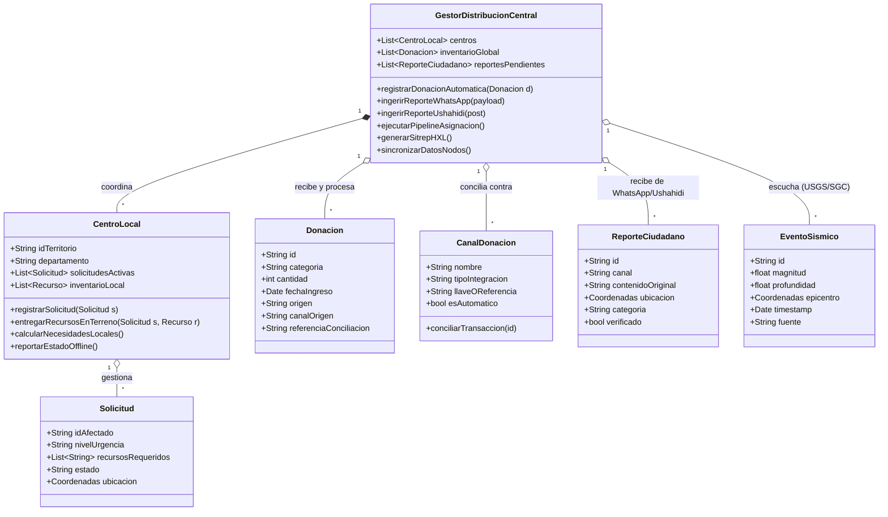

# Sistema de Distribución de Ayudas — Terremoto Colombia, Agosto 2026
### Arquitectura híbrida basada en APIs y sistemas reales de respuesta a desastres

---

## 0. Contexto real de la emergencia (para no diseñar en el vacío)

El 10 de agosto de 2026, a las 07:34 hora local, un sismo de magnitud 7.4 con epicentro en San José del Palmar (Chocó) sacudió el occidente colombiano. Es el terremoto de mayor magnitud registrado en Colombia en la última década (SGC). No se activó alerta de tsunami porque el foco fue profundo y tierra adentro.

Afectación reportada (cifras evolucionando al momento de escribir este documento, 12-13 de agosto de 2026):

- **Pereira / área metropolitana**: la ciudad más golpeada. Más de 60 edificaciones colapsadas, 65 con daños de consideración, decenas de fallecidos, cientos de heridos, 480+ personas atendidas en albergues en una sola noche. El Aeropuerto Matecaña sufrió daños estructurales parciales.
- **Zonas afectadas de forma oficial**: 9 municipios de Chocó, 8 de Caldas, 2 de Risaralda y 2 del Valle del Cauca, además de daños puntuales en Cali y Manizales.
- **Bogotá y Medellín**: sintieron el sismo pero sin afectaciones estructurales de consideración.

Esto **no es un ejercicio académico abstracto**: ya existe un ecosistema real de respuesta operando en paralelo, con vacíos concretos de coordinación que un sistema como el que propone `planoidea.md` sí puede resolver. El diseño de abajo está anclado a ese ecosistema real, no a una arquitectura genérica de "sistema de ayudas" de manual.

---

## 1. El problema real que vale la pena atacar

No hay un vacío de organizaciones ni de dinero — hay **fragmentación de canales**. Ah(a fecha de hoy) coexisten, sin interoperar entre sí:

| Actor | Canal actual | Limitación |
|---|---|---|
| Cruz Roja Colombiana | Campaña `#TodosPorColombia`, puntos físicos de acopio | Sin API pública, coordinación manual |
| ABACO (bancos de alimentos) | Corredor humanitario, cuenta Bancolombia + llave Bre-B `0090989753` (NIT 900326456-1) | Reconciliación de donaciones manual |
| Banco de Alimentos de Bogotá | Llave Bre-B `0091677852`, botón de donación en Rappi | Datos de origen de fondos aislados de ejecución en terreno |
| Rappi | Botón in-app ($20.000–$120.000 COP) + apoyo médico/psicológico vía SOS ReservaDoc | Plataforma cerrada, sin API externa |
| ~~terremotocolombia.com~~ | ⚠️ **Corrección**: verificado que este dominio redirige a `terremotovenezuela.com` (un mapa colaborativo de un sismo distinto, en Venezuela) y recolecta datos de contacto de quien se registra. **No es una plataforma legítima** — ver sección 9 (Nota sobre confianza y fraude) | No usar como referencia ni recomendarlo a nadie |
| UNGRD / SNGRD | SNIGRD (geoportal oficial), coordinación institucional | Sin API transaccional pública; los datos institucionales se comparten como SITREPs y capas geoespaciales (ICDE), no como REST |
| Bancos de sangre (IDCBIS, HUV, Cruz Roja Valle, Hemolife, Valle del Lili, Imbanaco) | Puntos físicos | Flujo logístico completamente distinto al de bienes materiales |

**Conclusión de diseño:** el sistema que propone `planoidea.md` no debería intentar *reemplazar* a Cruz Roja, ABACO o UNGRD — ninguno de ellos va a integrarse contigo en medio de una emergencia. Su valor real está en ser una **capa de agregación e interoperabilidad**: ingiere reportes ciudadanos y necesidades de terreno (donde sí puedes ser la fuente primaria), y expone esos datos en un formato que las instituciones grandes *sí* pueden consumir (estándar HXL, capas geoespaciales, SITREPs exportables). Esto es exactamente lo que hicieron los voluntarios de CrisisCamp Bogotá con Ushahidi y Sahana durante el terremoto de Haití en 2010 — el mismo patrón, aplicado ahora a un terremoto colombiano.

---

## 2. Arquitectura general (mismo modelo híbrido, con integraciones reales)

```
                    ┌─────────────────────────────────────────┐
                    │         NODO CENTRAL (Bogotá)            │
                    │  API Gateway · Pipeline de Asignación    │
                    │  Base de datos relacional + PostGIS      │
                    └──────────────┬────────────────────────────┘
                                   │  sincronización async
        ┌──────────────────────────┼──────────────────────────┐
        │                          │                           │
┌───────▼────────┐        ┌────────▼────────┐        ┌─────────▼────────┐
│ Nodo Local      │        │ Nodo Local       │        │ Nodo Local        │
│ Pereira/Risaralda│       │ Chocó            │        │ Caldas/Valle      │
│ Caché offline    │       │ Caché offline    │        │ Caché offline     │
└─────────────────┘        └─────────────────┘        └───────────────────┘

CAPA DE INTEGRACIÓN EXTERNA (el nodo central habla con esto, no con "el mundo"):
 ├─ Alertas sísmicas:        SGC (Red Sismológica Nacional) + USGS GeoJSON feed
 ├─ Ingesta ciudadana:       WhatsApp Business Cloud API (canal primario en zona de desastre)
 ├─ Mapeo colaborativo:      Ushahidi Platform API (autoalojado, ya probado en desastres LatAm)
 ├─ Donaciones monetarias:   Bre-B vía API de recaudo del banco aliado + PSE (fallback)
 ├─ Interoperabilidad datos: Estándar HXL (Humanitarian Exchange Language) + HDX/CKAN API
 └─ Coordinación oficial:    Exportación de SITREPs + capas WMS/WFS compatibles con ICDE/SNIGRD
```

La diferencia clave frente a la versión anterior del documento: **"Formularios Web/APIs" ya no es un placeholder genérico**. Cada flecha de ese diagrama corresponde a un sistema real, documentado, que existe hoy y que puedes empezar a integrar esta semana.

---

## 3. Sistemas externos reales — qué es cada uno y cómo se integra

### 3.1 Confirmación y monitoreo sísmico
- **Servicio Geológico Colombiano (SGC) — Red Sismológica Nacional de Colombia (RSNC):** fuente oficial colombiana del catálogo sísmico. Es la referencia institucional que deberías citar en cualquier reporte, pero no expone un webhook público sencillo de consumir en tiempo real para terceros.
- **USGS Earthquake GeoJSON Feed** (`earthquake.usgs.gov/earthquakes/feed/v1.0/summary/`): API pública, gratuita, sin autenticación, actualizada cada minuto. Devuelve magnitud, profundidad, coordenadas y tiempo. **Úsala como disparador automático**: si detectas un evento M≥6.0 en Colombia, tu pipeline puede auto-activar el modo "emergencia" (abrir formularios, notificar nodos locales, escalar capacidad) sin intervención manual.

### 3.2 Ingesta de reportes y solicitudes ciudadanas
- **WhatsApp Business Platform (Cloud API de Meta)**: es, en la práctica, el canal más realista para zonas con conectividad intermitente como Chocó — mucho más que un formulario web. Permite recibir mensajes estructurados (plantillas, botones, ubicación GPS) y responder automáticamente. Se integra vía webhook HTTPS + token de acceso; existen wrappers en Python (`whatsapp-python`, o directo con `requests` contra el Graph API).
- **SMS como fallback** (Twilio o un operador local): para las zonas donde ni WhatsApp funciona por cobertura de datos, pero sí hay señal 2G.

### 3.3 Mapeo colaborativo de necesidades y recursos
- **Ushahidi Platform** (`github.com/ushahidi/platform`): plataforma open source (PHP/Laravel backend + PostgreSQL) diseñada exactamente para esto — nació del post-electoral en Kenia 2008, se usó en el terremoto de Haití 2010 y en el terremoto de Nepal 2015. Expone una **REST API real** para crear, geolocalizar y categorizar "posts" (reportes) desde SMS, email, web o Twitter/X. En vez de construir tu propio backend de mapeo desde cero, puedes autoalojar Ushahidi (Docker disponible) y que tu "Pipeline de Asignación" consuma su API como fuente de reportes ciudadanos ya geolocalizados.

### 3.4 Ingesta y conciliación de donaciones monetarias
- **Bre-B**: el nuevo sistema de pagos inmediatos del Banco de la República (operativo desde julio de 2025, inspirado en Pix/Brasil y UPI/India). Es interoperable entre todos los bancos vía "llaves" (celular, correo, NIT, o alfanumérica) y funciona 24/7 sin costo para personas naturales. **Importante para el diseño**: Bre-B en sí no expone una API pública universal para terceros — la integración real ocurre a través del banco donde registras tu llave (ej. Bancolombia, Banco de Bogotá, Davivienda ofrecen "recaudo Bre-B" para empresas/ONG con generación de QR y, en algunos casos, API de conciliación de transacciones). El patrón correcto es: registrar una llave Bre-B institucional a través de un banco aliado → usar el API de recaudo/conciliación de ese banco para que tu sistema sepa automáticamente qué donación entró, sin depender de reportes manuales.
- **PSE** sigue vigente en paralelo a Bre-B para pagos en línea desde cuenta bancaria — mantenlo como fallback si el banco aliado no ofrece API de Bre-B todavía.
- **Reconciliación de canales cerrados** (Rappi, ABACO, Cruz Roja): estos no exponen API pública. La forma realista de integrarlos es como "fuentes declaradas" — el nodo central registra manualmente (o vía convenio institucional) los montos recibidos por estos canales para mantener trazabilidad total del flujo de recursos, aunque la ingesta no sea automática.

### 3.5 Interoperabilidad de datos humanitarios
- **HXL (Humanitarian Exchange Language)**: estándar de OCHA (Naciones Unidas) para etiquetar datos tabulares de forma que cualquier organización humanitaria los pueda leer sin acuerdos previos — literalmente una fila de encabezados con tags tipo `#affected+injured` o `#loc+name`. Es barato de implementar (solo estructura tus exports en CSV/JSON con esos tags) y te vuelve automáticamente legible por el ecosistema humanitario internacional.
- **HDX (Humanitarian Data Exchange, `data.humdata.org`)**: repositorio de OCHA basado en CKAN, con API REST estándar de CKAN. Si tu sistema genera reportes agregados (ej. "necesidades por municipio"), puedes publicarlos ahí para que ONG internacionales los descubran.

### 3.6 Coordinación institucional y geoespacial
- **UNGRD / SNGRD**: no tiene una API pública transaccional para "pedir recursos" — es un sistema institucional coordinado por Ley 1523 de 2012. Lo realista es que tu sistema **consuma** sus capas geoespaciales publicadas vía la Infraestructura Colombiana de Datos Espaciales (ICDE, estándares WMS/WFS abiertos) y **produzca** SITREPs (reportes de situación) exportables en un formato que un coordinador humano pueda subir o remitir al SNGRD. No prometas integración automática de dos vías con UNGRD — eso no existe hoy y prometerlo en el diseño sería engañoso.

---

## 4. Diagrama UML actualizado



---

## 5. Pseudocódigo actualizado — flujo automatizado con integraciones reales

```
// ESCUCHA DE EVENTOS SÍSMICOS (auto-activación)
Funcion escucharUSGS():
    Cada 60 segundos:
        eventos = GET("https://earthquake.usgs.gov/earthquakes/feed/v1.0/summary/significant_hour.geojson")
        Para cada evento en eventos:
            Si evento.magnitud >= 6.0 AND evento.pais == "Colombia":
                activarModoEmergencia(evento)

// INGESTA VÍA WHATSAPP BUSINESS CLOUD API
Funcion webhookWhatsApp(payload):
    mensaje = parsearMensajeEntrante(payload)
    reporte = ReporteCiudadano(
        canal = "whatsapp",
        contenidoOriginal = mensaje.texto,
        ubicacion = mensaje.ubicacionCompartida  // WhatsApp permite compartir GPS
    )
    clasificarUrgencia(reporte)  // heurística simple o modelo NLP ligero
    encolarParaVerificacion(reporte)
    responderPlantilla(mensaje.remitente, "Recibimos tu reporte, un equipo lo revisará")

// SINCRONIZACIÓN CON USHAHIDI (mapeo colaborativo)
Funcion sincronizarUshahidi():
    posts_nuevos = GET("https://<tu-instancia-ushahidi>/api/v5/posts?status=published")
    Para cada post en posts_nuevos:
        Si no existeEnSistema(post.id):
            crearReporteDesde(post)

// CONCILIACIÓN DE DONACIONES BRE-B
Funcion webhookConciliacionBancaria(transaccion):
    // Llega desde el API de recaudo del banco aliado (ej. Bancolombia API Recaudos)
    Si transaccion.llaveDestino == LLAVE_INSTITUCIONAL:
        donacion = Donacion(
            cantidad = transaccion.monto,
            canalOrigen = "bre-b",
            referenciaConciliacion = transaccion.id
        )
        registrarDonacionAutomatica(donacion)

// PIPELINE DE ASIGNACIÓN (igual que antes, ahora alimentado por fuentes reales)
Funcion ejecutarPipelineDeAsignacion():
    Para cada centro en centros:
        necesidades = centro.calcularNecesidadesLocales()  // incluye ReporteCiudadano verificados
        recursosAsignados = calcularProporcion(necesidades, donacionesGlobales)
        Si recursosAsignados > 0:
            centro.recibirRecursos(recursosAsignados)
            actualizarInventarioGlobal(recursosAsignados)

// EXPORTACIÓN PARA INTEROPERABILIDAD (HXL)
Funcion generarSitrepHXL():
    filas = agregarNecesidadesPorMunicipio()
    encabezados_hxl = ["#loc+name", "#affected+num", "#need+category", "#date+reported"]
    exportarCSV(encabezados_hxl, filas)
    // Este CSV es consumible directamente por HDX y por cualquier ONG internacional

// NODO LOCAL — igual, con reconocimiento de que la app debe ser offline-first
Clase CentroLocal:
    Funcion registrarSolicitud(solicitud):
        guardarEnCacheLocal(solicitud)  // SQLite local, no depende de red
        Si hayConexion():
            sincronizarConCentralAsync()
        Sino:
            encolarParaSincronizacionPosterior(solicitud)
```

---

## 6. Especificación de API REST (para generar en Claude Code)

Endpoints mínimos del **Nodo Central**, pensados para FastAPI (coherente con tu stack de Chinook/ShopStream):

```
POST   /api/v1/donaciones                      # ingesta manual/reconciliación
POST   /api/v1/webhooks/whatsapp                # webhook Meta Cloud API
POST   /api/v1/webhooks/bre-b                    # webhook del banco aliado
GET    /api/v1/reportes?estado=pendiente         # cola de verificación
POST   /api/v1/reportes/{id}/verificar
GET    /api/v1/centros/{id}/necesidades
POST   /api/v1/centros/{id}/entregas
GET    /api/v1/sitrep.csv?formato=hxl            # export HXL para HDX
GET    /api/v1/eventos-sismicos/ultimo
```

Autenticación: JWT para nodos locales (cada `CentroLocal` tiene sus credenciales), API key separada para webhooks entrantes con validación de firma (Meta firma sus webhooks con `X-Hub-Signature-256`; tu banco aliado debería ofrecer algo equivalente — pregunta explícitamente por esto antes de asumirlo).

---

## 7. Stack tecnológico recomendado (alineado a lo que ya conoces)

| Capa | Recomendación | Por qué |
|---|---|---|
| Backend Nodo Central | **FastAPI** + PostgreSQL/PostGIS | Ya usaste Flask/Zappa en ShopStream; FastAPI te da validación de esquemas nativa para los webhooks |
| Procesamiento de eventos | AWS Lambda + API Gateway | Mismo patrón que ShopStream (S3+Lambda) |
| Mapeo colaborativo | Ushahidi autoalojado (Docker) | No reinventar; integrar vía su REST API |
| App local offline-first | React/Vite + SQLite (o IndexedDB) con sync | Los nodos en Chocó necesitan seguir operando sin internet |
| Infraestructura | Terraform + GitHub Actions CI/CD | Ya es tu flujo en chinook-cloud-platform |
| Datos geoespaciales | PostGIS + capas WMS/WFS de ICDE | Compatibilidad directa con estándares del Estado colombiano |
| Interoperabilidad | Export HXL/CSV hacia HDX | Cero fricción con ONG internacionales |

---

## 8. Resiliencia (la parte que más importa en Chocó/Pereira ahora mismo)

- **Offline-first real**, no como checkbox: cada nodo local debe poder registrar solicitudes y entregas durante horas o días sin conexión, con sincronización por cola cuando vuelva la señal.
- **Degradación de canal**: WhatsApp → SMS → radio/reporte manual digitalizado por un voluntario, en ese orden de prioridad según la conectividad real de cada municipio.
- **Verificación humana obligatoria** antes de que un `ReporteCiudadano` se convierta en asignación de recursos — un sistema automatizado en medio de una crisis real es también un vector de desinformación o fraude si no hay un humano en el loop.

---

## 9. Nota sobre confianza y fraude

Esto ya no es una precaución teórica — son patrones **confirmados y activos** en esta emergencia específica:

- **`terremotocolombia.com`** se presenta como "plataforma ciudadana de código abierto para conectar reportes, voluntarios y recursos" — exactamente la propuesta de valor de este documento — pero en realidad redirige a `terremotovenezuela.com` (un mapa de un sismo distinto) y recolecta datos de contacto de quien se registra. Cualquier sistema propio debe diferenciarse de esto de forma obvia: identidad clara, sin ambigüedad sobre quién lo opera, sin recolectar más datos de los estrictamente necesarios.
- Formularios de reclutamiento de voluntarios/profesionales de salud han sido publicados en subdominios genéricos tipo `vercel.app` por medios legítimos — visualmente indistinguibles de un enlace de phishing. Si tu prototipo se despliega en una URL "gratuita" de una plataforma de hosting, comunica esto explícitamente para no sumarte sin querer a la lista de "cosas que parecen sospechosas pero no lo son".
- Transferencias por Nequi, Daviplata o Bre-B son inmediatas e irreversibles — ningún recaudador legítimo presiona para transferir en minutos. La urgencia artificial es en sí misma una señal de alerta.
- Ninguna entidad oficial cobra por registrar a alguien como voluntario, como damnificado, o para un subsidio.
- Han aparecido falsos "evaluadores de daños estructurales" que usan esa excusa para entrar a viviendas — un evaluador legítimo no exige entrar de inmediato ni cobra en la puerta.

Cualquier sistema que construyas debe:
- Mostrar de forma verificable el NIT/llave institucional que usa (como ya hacen ABACO y Banco de Alimentos publicando su llave Bre-B abiertamente).
- Nunca solicitar datos financieros sensibles por fuera de los canales oficiales del banco aliado.
- Dejar todo el flujo de conciliación auditable (esto es gratis si ya guardas `referenciaConciliacion` en cada `Donacion`).
- Tener un mecanismo explícito de **verificación antes de listar** cualquier colectivo u organización de terceros — nunca mostrar un canal de ayuda sin que un humano lo haya confirmado primero.

---

## 10. Siguientes pasos concretos

1. **Esta semana**: levantar una instancia Docker de Ushahidi y probar su API con datos simulados de Pereira/Chocó — es el componente de mayor apalancamiento y menor esfuerzo de construcción propia.
2. **Solicitar acceso** al Meta WhatsApp Business Cloud API (proceso de verificación de negocio, toma días — empezarlo ya).
3. **Contactar un banco aliado** (Bancolombia o similar) para entender si su API de recaudo Bre-B está disponible para ONG/proyectos — esto define si la conciliación de donaciones es automática o manual en v1.
4. **Prototipo con Cloud Code**: usar este `.md` para generar el esquema FastAPI de la sección 6, con mocks para los tres webhooks (WhatsApp, Ushahidi, banco) antes de tener credenciales reales.
5. **Definir con quién coordinas en terreno** — sin un canal institucional (aunque sea informal, vía Cruz Roja seccional Risaralda o la alcaldía de Pereira), el mejor sistema del mundo no mueve un solo bulto de mercado.

---

## Referencias

- Terremoto de Colombia de 2026 — Wikipedia: https://es.wikipedia.org/wiki/Terremoto_de_Colombia_de_2026
- El Tiempo — cobertura Pereira: https://www.eltiempo.com/justicia/investigacion/pereira-la-ciudad-mas-golpeada-por-el-terremoto-al-menos-67-victimas-mortales-3577462
- El Tiempo — canales oficiales de donación: https://www.eltiempo.com/colombia/otras-ciudades/como-ayudar-tras-terremoto-de-7-4-en-colombia-estos-son-los-centros-de-acopio-bancos-de-sangre-y-alimentos-canales-oficiales-y-puntos-de-donacion-3577631
- Portafolio — ABACO corredor humanitario: https://www.portafolio.co/negocios/empresas/que-donar-y-donde-hacerlo-tras-el-terremoto-que-sacudio-a-colombia-500051
- Portafolio — voluntariado y terremotocolombia.com: https://www.portafolio.co/economia/regiones/como-ayudar-a-los-damnificados-del-terremoto-pasos-para-inscribirme-como-voluntario-500130
- Banco de la República — Bre-B: https://www.banrep.gov.co/es/bre-b
- Ushahidi Platform (GitHub): https://github.com/ushahidi/platform
- USGS Earthquake GeoJSON Feed: https://earthquake.usgs.gov/earthquakes/feed/v1.0/summary/
- HXL Standard (OCHA): https://hxlstandard.org
- Humanitarian Data Exchange: https://data.humdata.org
- UNGRD — SNIGRD: https://snigrd.gestiondelriesgo.gov.co